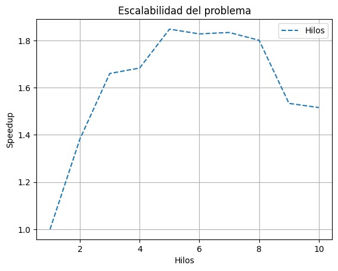

# Solución Paralela de la Ecuación de Laplace con OpenMP

Aca se busca paralelizar con el uso de OpenMP, de manera que se trabaja en memoria compartida.


## Código Fuente

```cpp
#include <iostream>
#include <vector>
#include <cmath> // Para std::abs
#include <algorithm> // Para std::max
#include <omp.h> // OpenMP
#include <sys/time.h> // Para medir tiempo

double seconds()
{
  struct timeval tmp;
  double sec;
  gettimeofday(&tmp, (struct timezone *)0);
  sec = tmp.tv_sec + ((double)tmp.tv_usec) / 1000000.0;

  return sec;
}

double calcular_delta(const std::vector<double> &phi, const std::vector<double> &phi_copy) {
    double delta = 0.0;
    for (size_t i = 0; i < phi.size(); ++i) {
        delta = std::max(delta, std::abs(phi[i] - phi_copy[i]));
    }
    return delta;
}

int main(int argc, char* argv[]) {
    if (argc != 7) {
        std::cerr << "Usage: " << argv[0] << " --N [Tamaño lineal de la grilla cuadrada (NxN)] --t [Tolerancia] --L [Tamaño lineal del capacitor cuadrado (LxL)]" << std::endl;
        return 1;
    }

    std::cout << "Bienvenido." << std::endl;
    std::cout << "Se está calculando la solución de la ecuación de Laplace bajo los parámetros definidos..." << std::endl;

    int N = atoi(argv[2]);
    double tolerance = atof(argv[4]);
    int L = atoi(argv[6]);
    int grilla_size = N + 1;

    std::vector<double> phi(grilla_size * grilla_size, 0.0);

    int start_y = (N / L) * 2.0;
    int end_y = (N / L) * 8.0;
    int plate_x1 = (N / L) * 2.0;
    int plate_x2 = (N / L) * 8.0;

    for (int i = start_y; i < end_y; ++i) {
        phi[i * grilla_size + plate_x1] = 1.0;
        phi[i * grilla_size + plate_x2] = -1.0;
    }

    std::vector<double> phi_copy = phi;

    double delta = 1.0;
    int its = 0;
    int num_procs;
    double time_1 = seconds();

    while (delta > tolerance) {
        its++;
#pragma omp parallel
        {
            num_procs = omp_get_num_threads();
#pragma omp for
            for (int i = 1; i < N; ++i) {
                for (int j = 1; j < N; ++j) {
                    if ((i >= start_y && i <= end_y) && (j == plate_x1 || j == plate_x2)) {
                        // No se modifica la placa
                    } else {
                        phi[i * grilla_size + j] = (1.0 / 4.0) *
                            (phi[(i + 1) * grilla_size + j] +
                             phi[(i - 1) * grilla_size + j] +
                             phi[i * grilla_size + (j + 1)] +
                             phi[i * grilla_size + (j - 1)]);
                    }
                }
            }
        }

        delta = calcular_delta(phi, phi_copy);
        phi_copy = phi;
    }

    double time_2 = seconds();
    std::cout << "Se llegó a la tolerancia tras " << its << " iteraciones." << std::endl;
    std::cout << "Número de hilos: " << num_procs << std::endl;
    std::cout << "Tiempo total: " << time_2 - time_1 << " segundos" << std::endl;

    return 0;
}
```

Converge tras 1143 iteraciones.

Escalabilidad:



