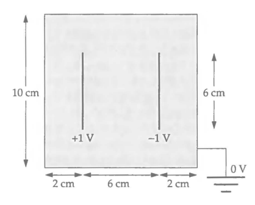

# MODELO SENCILLO DE UN CAPACITOR Y SU SOLUCIÓN NUMÉRICA (ELECTROSTÁTICA)

#Coordinadores: Marlon Brenes y Federico Muñoz

## Estudiantes

- **Carlos Echandi Jara (B92687)**
- **Natalia Iannarella Arguedas (A83166)**
- **Ángel Fabricio Aguirre Bermúdez (C10152)**
- **María Celeste Ureña Sandí (B98009)**

---

Bienvenido, este proyecto pretende resolver la ecuacion de Laplace aplicada a un capacitor electrónico ideal.

Se resuelve la ecuación de Laplace en dos dimensiones para el potencial electrostático

 &phi; = &phi;(x, y)

---

En una placa cuadrada de 10 cm × 10 cm . El problema modela de forma ideal el capacitor electronico que se presenta en la siguiente figura:

## Descripción

Este proyecto incluye:

- Métodos numéricos para resolver ecuaciones diferenciales parciales.
- Implementaciones en Python y C++.
- Simulaciones paralelas con OpenMP y MPI.
- Visualización de resultados y análisis numérico.

