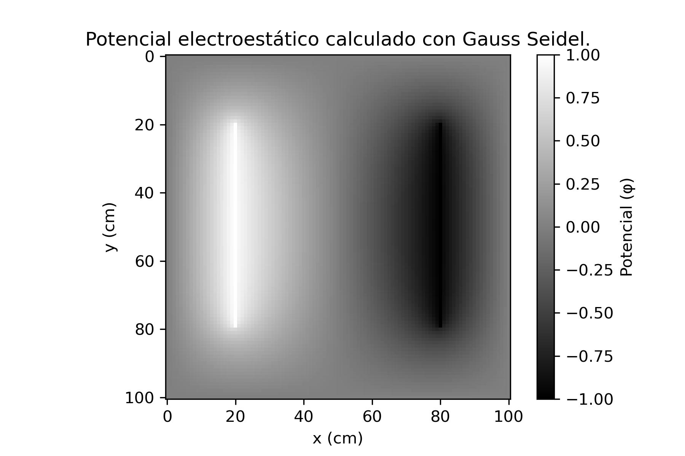

# Método de Gauss-Seidel

En script se implementa el método de Gauss-Seidel, en el que se busca iterar sobre el mismo campo en memoria, lo que permite una convergencia mas rapida. De todas maneras, por la naturaleza del método, es necesario usar `for` loops, lo que afecta la velocidad.

---

## Código en Python

```python
#!/usr/bin/env python

import numpy as np

def gauss_seidel(N=100, tolerance=1e-5, L=10, V1=1, V2=-1):
    # Iniciación de phi
    phi = np.zeros((N + 1, N + 1), dtype=float)
    
    # Condiciones iniciales (placas)
    phi[int((N/L)*2):int((N/L)*8), int((N/L)*2)] = V1
    phi[int((N/L)*2):int((N/L)*8), int((N/L)*8)] = V2
    
    # Copia para evaluar el error
    phi_copy = phi.copy()
    
    delta = 1.0
    its = 0

    while delta > tolerance:
        its += 1
        
        # Iteración de Gauss-Seidel
        for i in range(1, N):
            for j in range(1, N):
                phi[i, j] = (phi[i+1, j] + phi[i-1, j] + phi[i, j+1] + phi[i, j-1]) / 4.0
        
        # Restauro el potencial en las placas
        phi[int((N / L) * 2):int((N / L) * 8), int((N / L) * 2)] = V1
        phi[int((N / L) * 2):int((N / L) * 8), int((N / L) * 8)] = V2

        # Evaluar la convergencia
        delta = np.max(np.abs(phi - phi_copy))
        phi_copy = phi.copy()

    return phi, its

gauss_vals, iterations = gauss_seidel()
print(iterations)
```

Este método converge en 1196 iteraciones, una gran mejora respecto a Jacobi (1803 iteraciones).

Gráfico


