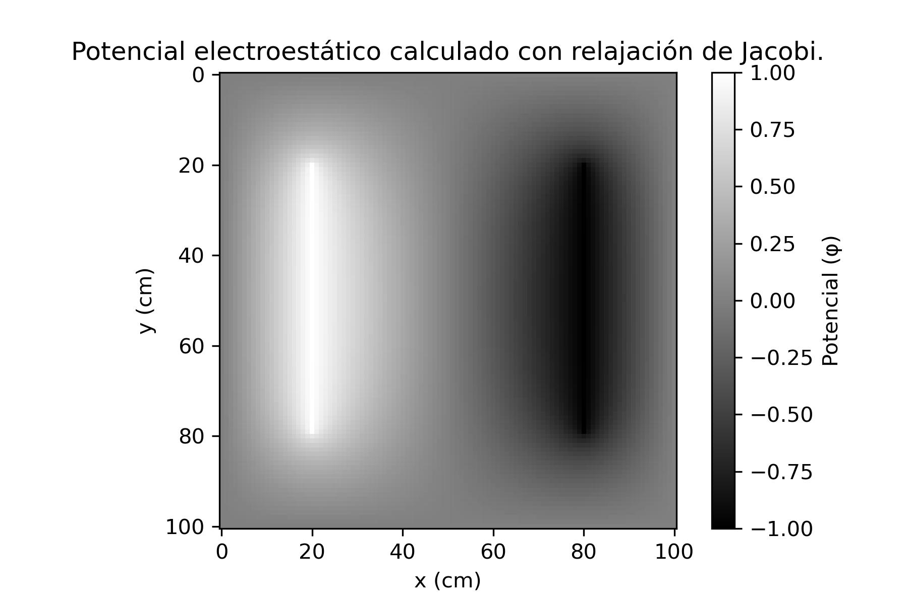

# Relajación Jacobi

Este script implementa el método de relajación Jacobi para resolver sistemas de ecuaciones en una grilla 2D. Es útil en aplicaciones como simulaciones de potencial eléctrico.

## Código

```python
import numpy as np
def jacobi_relaxation(N=100, tolerance=1e-5, L=10, V1=1, V2=-1):
    # Iniciación de phi
    phi = np.zeros((N + 1, N + 1), dtype=float)
    # Condiciones iniciales (placas)
    phi[int((N/L)*2):int((N/L)*8), int((N/L)*2)] = V1
    phi[int((N/L)*2):int((N/L)*8), int((N/L)*8)] = V2

    delta = 1.0
    its = 0
    
    while delta > tolerance:
        its += 1
        phi_new = phi.copy()
        phi_new[1:N, 1:N] = (1.0/4.0) * (
            phi[2:N + 1, 1:N] +
            phi[0:N - 1, 1:N] +
            phi[1:N, 2:N + 1] +
            phi[1:N, 0:N - 1]
        )
        # Restauro el potencial en las placas
        phi_new[int((N / L) * 2):int((N / L) * 8), int((N / L) * 2)] = V1
        phi_new[int((N / L) * 2):int((N / L) * 8), int((N / L) * 8)] = V2

        delta = np.max(np.abs(phi - phi_new))
        phi = phi_new
        
    return phi, its

jacobi_vals, iterations = jacobi_relaxation()
print(iterations)

En el jupyter:
import matplotlib.pyplot as plt
import matplotlib.cm as cm

plt.imshow(jacobi_vals)
plt.gray()
plt.show()
```

Gráfico

